# hello_world

A new Flutter project.

## Getting Started

--> The app output shows the text “A random idea:” and a combination of two random words generated using Provider state management (ChangeNotifier) from MyAppState

--> The app output shows the text “A random AWESOME idea:” and the combination of two random words, which is updated instantly using the hot reload feature

--> The app output shows the text “A random AWESOME idea:”, a combination of two random words, and a Next button that, when pressed, executes a simple action that prints a message to the console

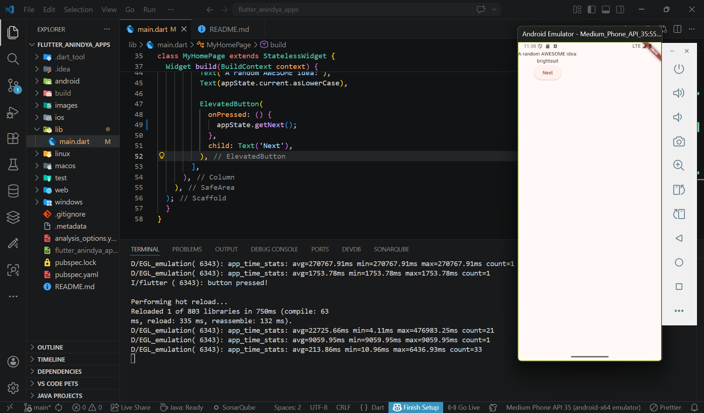
--> The app output shows the text “A random AWESOME idea:”, a combination of two random words, and a Next button that generates a new word each time it is pressed, thanks to the getNext() function in the Provider state management which updates the data and calls notifyListeners()

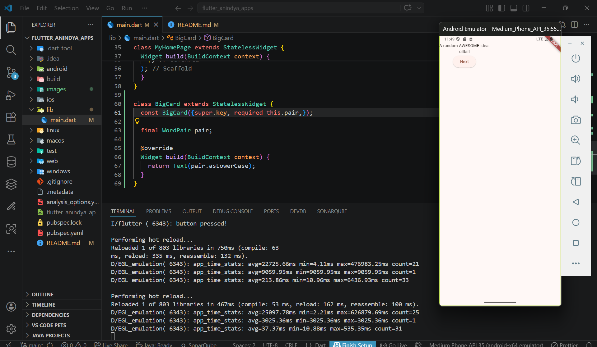
--> The app output shows the text “A random AWESOME idea:”, a combination of two random words taken from the variable pair, and a Next button to generate new words, with the display separated into the BigCard widget

--> The app output shows the text “A random AWESOME idea:”, a combination of two random words displayed inside a Card, and a Next button to generate new words, with the data managed using Provider state management (ChangeNotifierProvider)

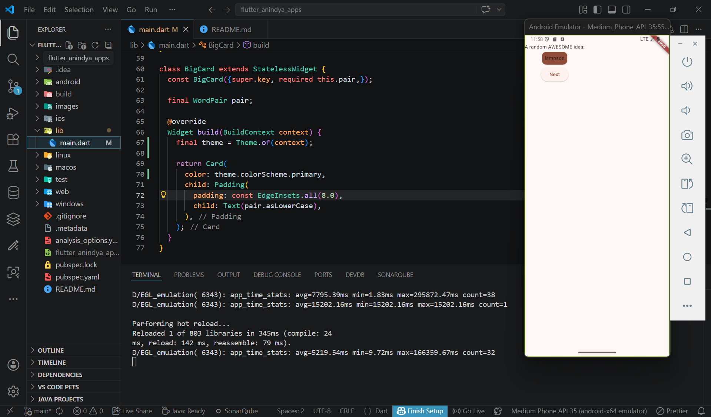
--> The app output shows the text “A random AWESOME idea:”, a combination of two random words in a Card whose color follows the app theme, because of Theme.of(context), along with a Next button to generate new words, with data managed by Provider (ChangeNotifierProvider)

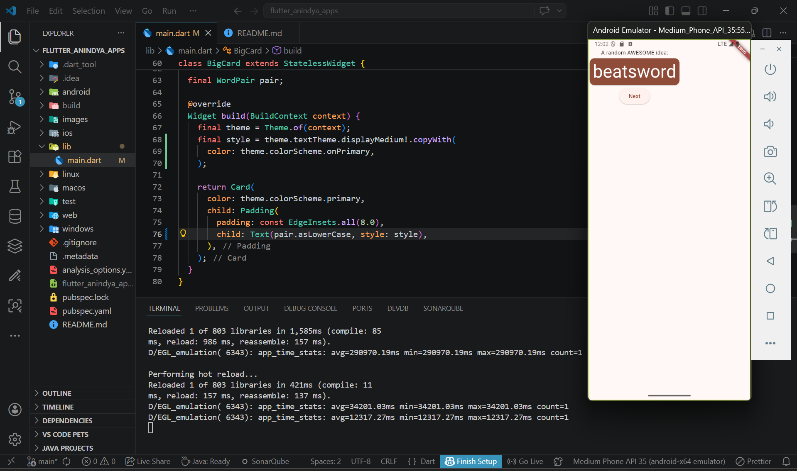
--> The app output is similar to the previous step, but now the combination of two random words in the Card also follows the app’s text style, and the Next button still generates new words

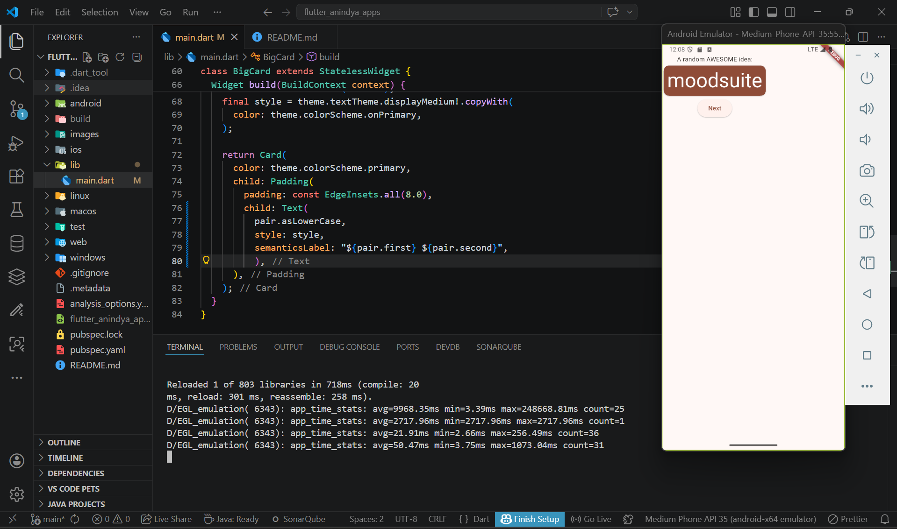
--> The app output remains the same, showing two random words in a Card, but now a semanticsLabel is added to improve accessibility support

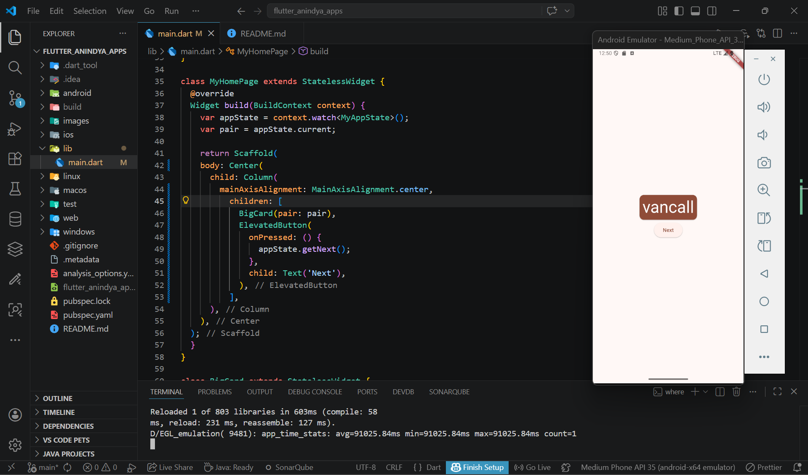
--> At this step, all components (the text “A random AWESOME idea:”, the combination of two random words in the Card, and the Next button) are centered on the screen using the Center widget

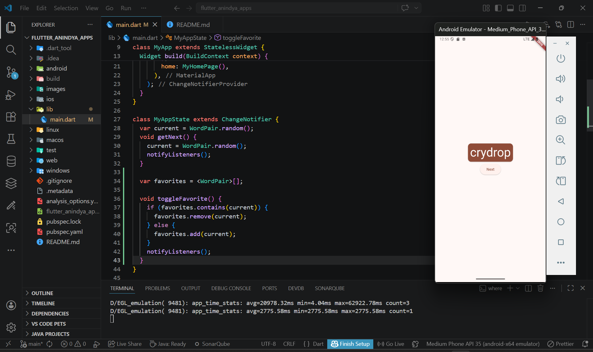
--> The added code provides logic to store and manage a list of favorite words. The toggleFavorite() function adds or removes a word from the favorites list, with state updates handled by Provider (ChangeNotifierProvider)

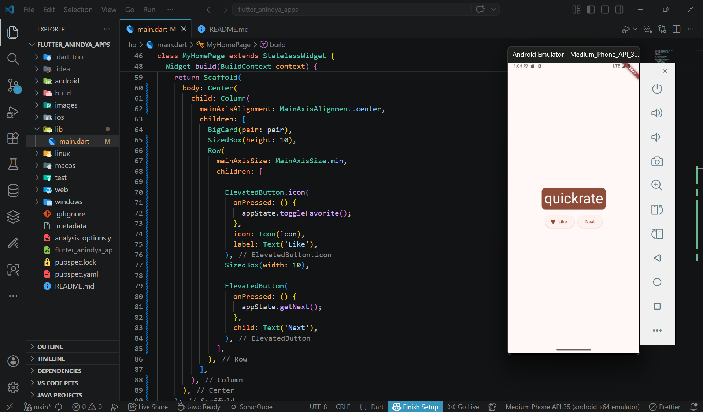
--> The app output shows the combination of two random words in a Card, along with two buttons—Like and Next—arranged in a single row using Row with mainAxisSize: MainAxisSize.min. The Like button adds or removes the word from favorites, and its icon changes according to the word’s statusi

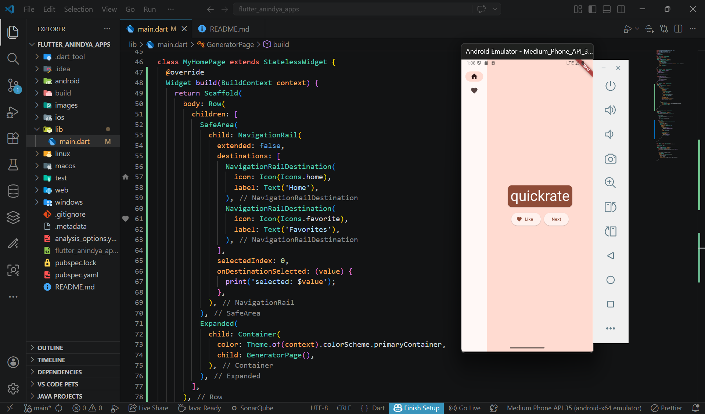
--> The app output displays a NavigationRail sidebar with Home and Favorites menus, while the main page shows a combination of two random words in a Card, with Like and Next buttons aligned horizontally

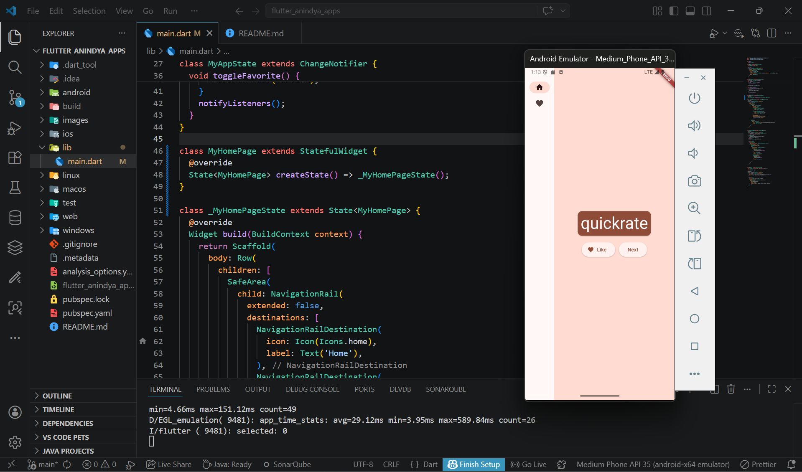
--> This change converts MyHomePage from a StatelessWidget to a StatefulWidget, allowing the page to hold and manage its own state when needed

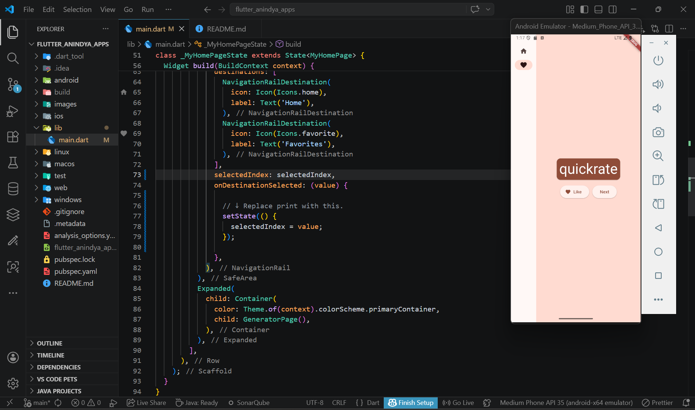
--> This change enables the app to store and update the selected menu index on the NavigationRail, so when the user selects a menu, the display updates dynamically using setState() in the StatefulWidget

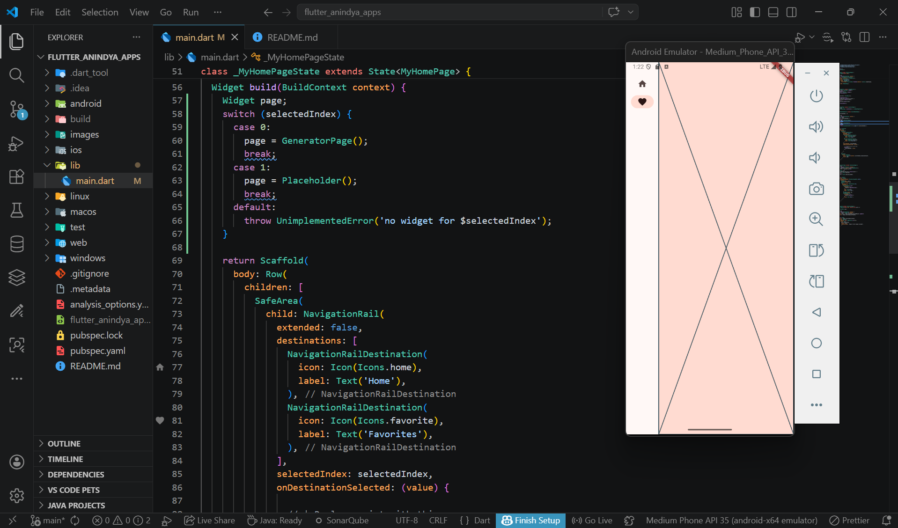
--> This change allows the app to display different pages depending on the menu selected in the NavigationRail. The selectedIndex value determines whether GeneratorPage or another page is shown, enabling dynamic page navigation using setState(). The Placeholder page is a crossed rectangle indicating that the page hasn’t been created yet, since the FavoritesPage is not implemented at this stage

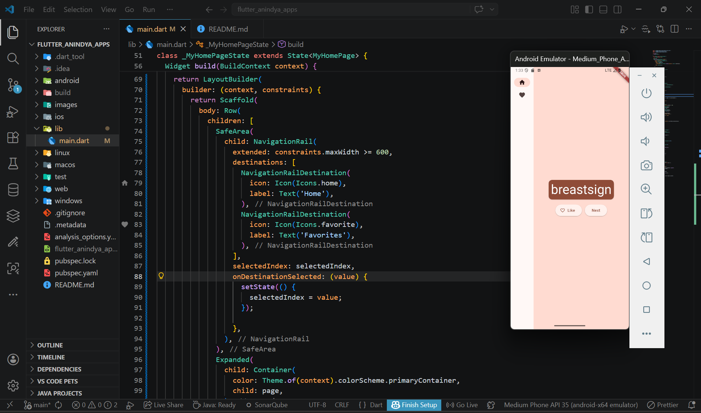
--> This change makes the app layout responsive. The NavigationRail automatically expands (extended) when the screen width reaches a certain threshold (≥ 600), using LayoutBuilder to read the screen size and adjust the layout dynamically

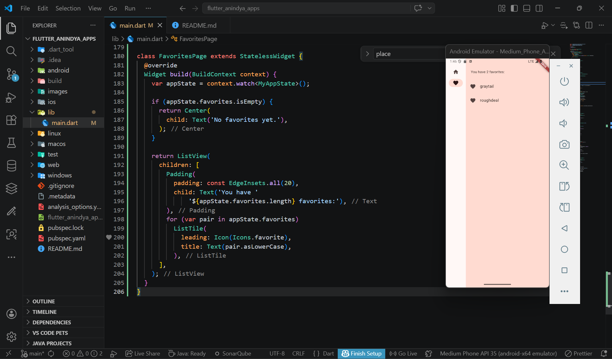
--> The app output shows the Favorites page containing a list of liked words. If there are no favorites yet, it displays the message “No favorites yet.” Otherwise, the favorites are displayed in a ListView with favorite icons. The data is retrieved and updated dynamically using Provider (ChangeNotifierProvider)
